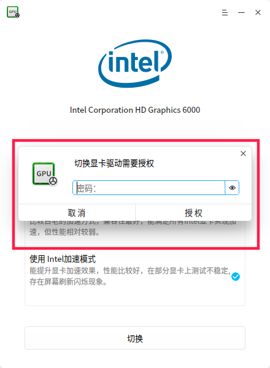

# 以管理员身份运行你的应用——polkit

在开发Linux桌面软件的时候，应用的大部分操作都是以普通用户的身份来运行的，这样比较安全。但又有时候我们需要用其他用户的身份执行一些操作，通常是root用户。

## 方法一：sudo命令

以gedit为例
通常我们都是直接执行```sudo gedit```来临时提升权限，这时我们需要手动输入密码进行验证

``` shell
echo "passwd" | sudo -S gedit
# sudo 的-S选项是从标准输出流读取密码
```

如果使用这种方法，密码无误的话就可以正常执行了，不会弹出授权窗口。你可以自己写一个弹窗，如果这样，在索要用户权限的时候，程序就可以获得用户的密码了（容易受到用户的质疑），自己使用的程序倒是无妨，如果软件是需要开放给用户使用不推荐。

## 方法二：polkit

如图所示：  
  
这个窗口常见到吧，这个是怎么调出来的呢？

常见的Linux发行版都有polkit模块，deepin也开发了一套，称为[dde-polkit-agent](https://github.com/linuxdeepin/dde-polkit-agent)，它是遵守[polkit的freedesktop规范](https://www.freedesktop.org/software/polkit/docs/latest/polkit.8.html)的。
我们只要配置好规则文件然后在终端执行：```pkexec [可执行文件]```就可以看到这个授权窗口

1 创建policy配置文件

以deepin的/usr/share/polkit-1/actions/com.deepin.pkexec.dde-file-manager.policy文件为例：  
示例中被```<！-- -->```包裹的是注释，会被polkit忽略掉

``` xml
<?xml version="1.0" encoding="UTF-8"?>
<!DOCTYPE policyconfig PUBLIC
 "-//freedesktop//DTD PolicyKit Policy Configuration 1.0//EN"
 "http://www.freedesktop.org/standards/PolicyKit/1/policyconfig.dtd">
<policyconfig>
  <vendor>Deepin</vendor>
  <vendor_url>https://www.deepin.com</vendor_url>
  <!-- 权限ID，这个必须唯一 -->
  <action id="com.deepin.pkexec.dde-file-manager">
    <!-- 图标 这个我不知道存在哪里，再研究研究-->
    <icon_name>folder</icon_name>
    <!-- 弹窗提示 -->
    <message>Authentication is required to run the Deepin File Manager</message>
    <defaults>
      <allow_any>no</allow_any>
      <allow_inactive>no</allow_inactive>
      <allow_active>auth_admin_keep</allow_active>
      <!-- 这个defaults节点下的所有子节点可以有这些值no,yes,auth_self,auth_admin,auth_self_keep,auth_admin_keep　-->
    </defaults>
    <!-- 语言为简体中文时的弹窗提示 -->
    <message xml:lang="zh_CN">查看文件夹需要输入密码</message>
    <!-- 权限提升的可执行文件，需是二进制文件 -->
    <annotate key="org.freedesktop.policykit.exec.path">/usr/bin/dde-file-manager</annotate>
    <!-- 这行听说是是否允许GUI，但是测试的时候好像不起作用 -->
    <annotate key="org.freedesktop.policykit.exec.allow_gui">true</annotate>
  </action>
</policyconfig>
```

只需要根据你的需要创建一份这样的文件（以policy结尾），然后保存到/usr/share/polkit-1/action这个目录下。
可以执行```pkaction```查看现有的policy

2 调出弹窗

在终端执行```pkexec [二进制可执行文件]```
当然，根据上述配置文件，显然应该执行```pkexec /usr/bin/dde-file-manager```
> Tips:  
如果要给脚本提权怎么办呢？因为pkexec后面需要接一个二进制的可执行文件，我们就需要借助一个shell解释器——它是一个二进制的可执行文件，我们选用/bin/bash，先给bash创建一个policy文件[deepin不用创建，已经有了]，然后执行```pkexec /bin/bash -x [脚本]```将脚本作为bash的参数【在deepin下执行有个副作用，因为深度显卡驱动管理器的脚本提权用到了bash，所以会显示驱动管理器的图标和提示】

参考：  
[freedestop的polkit介绍](https://www.freedesktop.org/software/polkit/docs/latest/polkit.8.html)  
[freedesktop的pkexec介绍](https://www.freedesktop.org/software/polkit/docs/latest/pkexec.1.html)  
[深度文件管理器技术填坑笔记
](https://segmentfault.com/a/1190000008063961)